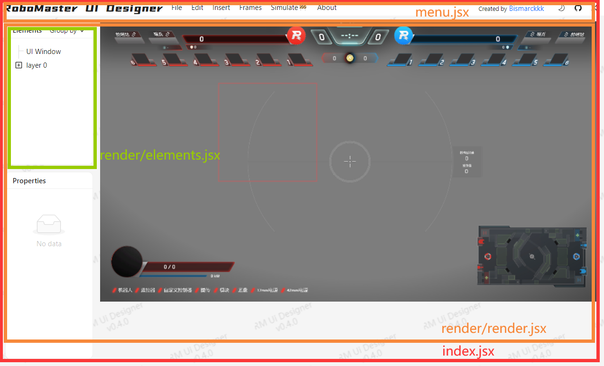

# RoboMaster UI Designer
## 如何使用
在bbs上有一个简易的[使用教程](https://bbs.robomaster.com/forum.php?mod=viewthread&tid=22955)供参考，也可以直接通过以下途径使用  

1. 直接使用我们的[在线Demo](https://ui.bismarck.xyz/)
2. 打开在线Demo后使用浏览器弹出的安装应用功能安装PWA应用以供离线使用
3. 在Release中下载我们使用Tauri打包的本地应用，支持Windows、Linux、MacOS平台

各客户端可自由选择，数据类型互通，均自备自动更新功能  

如果在使用过程中遇到故障，请先测试[nightly版本](https://ui.bismarck.xyz/nightly/)中是否存在相同问题，如有请提交issue或联系作者  

## 自行部署
本项目为纯前端项目，可直接部署在任何静态服务器上，如Nginx、Apache等，
在线demo使用Github Pages托管，如需自行构建前端可以参考以下步骤：
```shell
git clone https://github.com/bismarckkk/RM-UI-Designer.git
cd RM-UI-Designer
yarn
yarn build
```
如果需要自行构建Tauri应用，首先需要配置Tauri编译环境，
然后自行生成签名密钥并配置`tauri.conf.json`中的`tauri.updater.pubKey`字段，
将私钥和密码加入环境变量，然后执行以下命令进行构建  
```shell
yarn tauri build
```

也可以在Github上Fork我们的项目，利用Github Action进行跨平台构建

## 路线图
- 基本组件
  - [x] 直线
  - [x] 矩形
  - [x] 正圆
  - [x] 椭圆
  - [x] 文本
  - [x] 圆弧
  - [x] 自定义背景图
- 高级组件
  - [ ] 旋转矩形
  - [ ] 平行四边形
  - [ ] 路径
- 编辑功能
  - [x] 拖拽
  - [x] 缩放
  - [ ] 通过缩放翻转
  - [x] 撤销/重做
  - [x] 多选
  - [x] 复制/粘贴
  - [x] 删除
  - [x] 自动保存到浏览器
  - [x] 保存/读取文件
  - [x] 在同一工程中切换frame
- 高级功能
  - [x] 生成代码
  - [x] 双向模拟器
  - [x] PWA应用
  - [x] Tauri应用
- 功能改进
  - [ ] 文本切换为自绘方案，与客户端对齐
  - [ ] 历史记录采用内部事件机制记录，不再保存整个画布

## 贡献代码

欢迎修复任何bug或添加上述路线图中的功能，请fork本项目主分支，然后提交PR，PR需要任何一个管理员审核通过即可合并  

### 项目结构

详见[代码目录结构](./doc/directory.md)

### 组件结构


### 联系作者
* Email: [zuoqingyu@nuaa.edu.cn](mailto:zuoqingyu@nuaa.edu.cn)
* QQ: 3040585972
